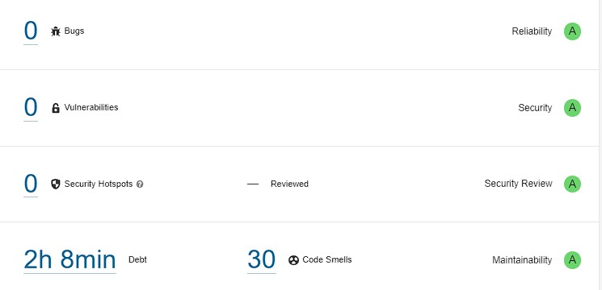

PROJECT Design Documentation
============================

Team Information
----------------

-   Team name: Lightning

-   Team members

    -   Ben Sippel

    -   Andrew Apollo

    -   Jessica Ahls

    -   Aidan Ruiz

Executive Summary
-----------------

An E-Store for the NHL Hockey Team Tampa Bay Lightning.

### Purpose

>   Customers can browse jerseys, add jerseys to cart, and make purchases. Admin
>   are allowed to edit the inventory, adding or removing jerseys as they see
>   fit.

### Glossary and Acronyms

>   *A table of terms and acronyms.*

| Term | Definition  |
|------|-------------|
| SPA  | Single Page |

Requirements
------------

This section describes the features of the application.

### Definition of MVP

>   *The Minimum Viable Product involves an E-Store with basic front and
>   back-end capabilities. The admin of the site should be able to create new
>   jerseys to be shown on the site, being able to determine the name, price,
>   size, and color for the jersey, and determine the quantity of the jersey in
>   the inventory. The admin can also edit the jersey’s information to change
>   one or more attributes. The admin can also remove jerseys so that they are
>   no longer displayed on the site. As a customer, you are able to log into
>   your personal account and have a cart that persists through logging in/out.
>   You can browse the in-stock jerseys and add to your cart. In your cart, you
>   can increase the quantities of the jerseys in your cart and checkout, which
>   clears your cart.*

### MVP Features

>   *API Functionality*

    Create new product

    -   Get a single product

    -   Get entire inventory

    -   Delete a single product

    -   Update product

    -   Search Product

    Admin Functionality

    -   Edit Jersey Information

    -   Add to Inventory

    -   Remove from Inventory

    -   Admin Login

    Customer Functionality

    -   Browse Products

    -   View a Product

    -   Add to Cart

    -   Remove from Cart

    -   Change Quantity

    -   Cart Checkout

    -   Customer Login

### Roadmap of Enhancements

>   *Future enhancements:*

When the admin removes a jersey that a customer has in their cart, this change
should be reflected in the customer’s cart, furthermore they should not be able
to check out a jersey that has been removed. During the checkout process, the
customer should be required to enter their shipping and billing information and
this information should be validated, whether it be for formatting or if the
address and payment information themselves are valid. Our 10% feature involves a
finite stock that is updated when a customer checks out jerseys from the site. A
customer should not be able to add more jerseys than what is in the inventory to
their cart, therefore when the customer checks out, the in-stock quantity will
decrease successfully. Customers will be able to view what jerseys are low in
stock and see what jerseys are unavailable, or having a quantity of 0 available.

Application Domain
------------------

> *This section describes the application domain.*

>   This Estore will begin with a User entering the site and being able to
>   either explore the site or enter their credentials. If the user is a
>   customer, they will have access to their personal cart and be able to browse
>   and select jerseys they wish to add to cart. If the user is an admin, they
>   will be able to add, remove, or edit jersey data.

Architecture and Design
-----------------------

This section describes the application architecture.

### Summary

The following Tiers/Layers model shows a high-level view of the webapp's
architecture.

The e-store web application, is built using the Model–View–ViewModel (MVVM)
architecture pattern.

The Model stores the application data objects including any functionality to
provide persistance.

The View is the client-side SPA built with Angular utilizing HTML, CSS and
TypeScript. The ViewModel provides RESTful APIs to the client (View) as well as
any logic required to manipulate the data objects from the Model.

Both the ViewModel and Model are built using Java and Spring Framework. Details
of the components within these tiers are supplied below.

### Overview of User Interface

This section describes the web interface flow; this is how the user views and
interacts with the e-store application.

#### Customers

>   A user visits the e-store and is greeted with a view of all the jerseys
>   available. They can search for a Jersey by name and see the Browse page
>   update simultaneously to show only matching Jerseys. Clicking on a Jersey
>   allows them to view its details. In order to purchase Jerseys they visit the
>   login page and enter valid login credentials. After logging in they now see
>   a cart they can navigate to at the top of the page. When viewing a Jersey's
>   details there is now an option to add to cart. Adding a Jersey to cart will
>   immediately bring them to their newly updated cart. Users can change the
>   quantity of a cart item by 1 or by entering in a custom value. If they
>   decide they no longer want to purchase a Jersey they can remove it from
>   cart. Users can view their cart's total on the right of the cart page and it
>   will be updated whenever they make changes. When they want to checkout users
>   click the checkout button and their cart will be cleared.

#### Owner

>   Once logging in with valid credentials owners have all the functionality of
>   a user that is logged in, except they do not have a cart and cannot purchase
>   Jerseys, instead there is an inventory page where they can manage their
>   stock. Once on the inventory page, admins see a list of Jerseys and their
>   names sorted by ID. They can remove a Jersey from inventory by clicking the
>   'X' next to its name, and if they give confirmation it is deleted. If they
>   press the 'Add new Jersey' button they are taken to a new page that allows
>   them to create a new Jersey in inventory. There is a 'Go Back' button that
>   takes them back to inventory. Admins can modify a Jersey's any of a Jersey's
>   attributes by clicking on its name on the list. Admins cannot add or update
>   a Jersey so that it has completely identical attributes as another, and if
>   they attempt to do so, they are notified of the failure to create/update.

### View Tier
> *The following sequence diagrams show how the View and ViewModel interact, and include relevant HTTP requests from the client-side to the server-side to help illustrate the end-to-end flow.*
#### LoginComponent

> *A user logging on and off the E-store.*
#### BrowseJerseysComponent and JerseyDetailComponent

> *A customer browsing, searching, and reading the details of Jerseys in the E-store.*
#### ShoppingCartComponent

> *A customer managing their cart by adding, removing, and updating the quantity of cart items.*
#### InventoryComponent

> *An admin viewing and removing items from inventory.*
#### AddJerseyComponent, and EditJerseyComponent

> *An admin managing inventory by adding and updating items in the inventory. Includes the cases when an admin attempts to create a duplicate Jersey.*

### ViewModel Tier
> *An overview of the ViewModel tier of the application's architecture. Includes UML
> diagrams of all controllers and services.*
#### Controllers

#### Services

### Model Tier
> *An overview of the Model tier of the application's architecture. Includes UML
> diagrams of Model and Persistence sections.*
#### Model

> - *Jerseys's equals() returns true if all fields are equivalent excluding id.*
> - *CartItems's equals() returns true if the jerseys are equivalent.*
> - *User's equals() returns true if the usernames are equivalent.*

#### Persistence

> *Each FileDAO keeps a local cache of jerseys, shopping carts, and users respectively, 
> initialized from three json files which are updated whenever a change is made.*

### Static Code Analysis

>   SonarQube static code analysis reports for our backend show that we've attained
>   high grades for our code coverage and quality. There is however some code smell and tech
>   debt, but it seems that these mostly involve the accessibility of certain
>   methods rather than any critical flaws, for example, a lot of accumulated debt comes
>   from unit tests having public modifiers where they aren't needed.
>   
>   
>
>   We have also achieved high grades for code quality on our frontend. There is some code smell,
>   however, this appears to be accumulated from some instances of commented out code
>   and uses of `var` instead of `let` rather than anything particularly critical
>   that could cause a problem for either security or maintainability.

>   

### Recommendations for Improvement
> Shopping Cart implementation may not have been optimal, as Shopping carts were stored based on username rather than ID, which may cause issues if for whatever reason there is a need for changing usernames in the future. There were also some odd request methods for different cart functionalities, e.g. PUT request clearing cart. The rest of our project turned out to work pretty smoothly and we did not wish to change much else.

### Design Principles Analysis
>   **Single Responsibility Principle** - The JerseyController, CartController, and UserController are examples of where this principle has been implemented. Each controller's
purpose is to handle their respective subject's API requests and provide responses using HTTP protocols. The management of the subject's data is taken care of in the JerseyDAO, CartDAO, and UserDAO.

>   **Dependency Inversion Principle** - We have also used multiple services in the UI JerseyService, CartService, AuthGuardService, AuthenticationService which are injected into various components which allows the logic of the UI to be independent from where the https requests are sent.

>   **Open/Closed Principle** - This is demonstrated in the JerseyController, CartController, and AuthController because they each take in higher level abstractions of JerseyDAO, CartDAO, and UserDao. JerseyFileDAO, CartFileDAO, and UserFileDAO are injected into their respective controllers and ones that need access to their subject's data. This
allows us to test the Controllers and FileDAO independently. It also provides a mechanism for extending functionality without modification because the data is managed separately from the controllers. 

Testing
-------

>   *This section will provide information about the testing performed and the
>   results of the testing.*

### Acceptance Testing

>   We have 20 user stories and 29 acceptance criteria tests. All user stories
>   have at least one test. As of Sprint 4 all acceptance criteria tests are
>   passing. Some issues that we found during testing was that testing criteria
>   sometimes overlaped between user stories and this could be improved on by being
>   more concise.

### Unit Testing and Code Coverage

>   Our team's unit testing strategy was to have as much code coverage as possible.
>   We met our goal and got an overall code coverage of 99%.

#### Overview

>
#### Model

>
#### Controller

>
#### Persistence

>
